[Merged mining](https://rootstock.io/mine-btc-with-rootstock/) is the process that allows Rootstock blockchain to be mined simultaneously with Bitcoin blockchain. This can be done because both chains use the same proof-of-work (PoW) algorithm, double SHA-256.

<Button href="/node-operators/merged-mining/getting-started/">Get Started</Button>

## How it works

Merged mining reuses Bitcoin hashrate. Pools include a hash commitment to the Rootstock block header in the Bitcoin coinbase of each job. When a miner finds a solution, the pool compares it to both network difficulties. A Rootstock block still requires submitting the merge-mining proof to a Rootstock node.

### Architecture diagram

A pool sends a job to a miner. The pool then checks the solution against Bitcoin and Rootstock difficulty. A valid Rootstock block still needs a merge-mining proof sent to a Rootstock node. Results can be a Bitcoin block, a Rootstock-only block, or a pool share.

```mermaid
flowchart LR
  Pool["Bitcoin mining pool"]
  Miner["Miner hashrate"]
  Comp{"Compare solution<br/>to difficulties"}

  BTC["Bitcoin block<br/>(meets Bitcoin difficulty)"]
  Proof["Submit merge-mining proof<br/>to Rootstock node"]
  RSK["Rootstock block"]
  Share["Pool share only<br/>(not broadcast)"]

  Pool -->|"1. Job: coinbase hash<br/>commitment to Rootstock<br/>block header"| Miner
  Miner -->|"2. Submit solution"| Comp
  Comp -->|"3a. Meets Bitcoin"| BTC
  Comp -->|"3b. Meets Rootstock only<br/>(below Bitcoin difficulty)"| Proof
  Comp -->|"3c. Below both"| Share
  BTC -->|"4. Also build and submit<br/>merge-mining proof"| Proof
  Proof -->|"5. Coinbase commitment,<br/>merkle proof, header"| RSK

  classDef pool fill:#EDE7FF,stroke:#9E76FF,stroke-width:2px,color:#1a1a1a
  classDef miner fill:#FCE4F6,stroke:#FF71E1,stroke-width:2px,color:#1a1a1a
  classDef decision fill:#F5F5F5,stroke:#666666,stroke-width:2px,color:#1a1a1a
  classDef btc fill:#FFF0D9,stroke:#FF9100,stroke-width:2px,color:#1a1a1a
  classDef rsk fill:#E8F5D0,stroke:#79C600,stroke-width:2px,color:#1a1a1a
  classDef share fill:#EEEEEE,stroke:#888888,stroke-width:2px,color:#1a1a1a
  classDef proof fill:#E0FFFA,stroke:#08FFD0,stroke-width:2px,color:#1a1a1a

  class Pool pool
  class Miner miner
  class Comp decision
  class BTC btc
  class RSK rsk
  class Share share
  class Proof proof
```

A solution that meets Bitcoin difficulty also meets Rootstock difficulty, because Rootstock difficulty is lower. You still submit a merge-mining proof (coinbase commitment, merkle proof, and header) to a Rootstock node. Path 3b is Rootstock-only when the solution is below Bitcoin difficulty.

When miners find a solution, the pool checks both difficulties:

- Solution meets Bitcoin difficulty. A Bitcoin block is assembled and broadcast. The coinbase commitment is ignored by Bitcoin. The same work is used to build and submit a merge-mining proof to Rootstock.
- Solution meets Rootstock difficulty only (below Bitcoin difficulty). The merge-mining proof is submitted to Rootstock, not to Bitcoin.
- Solution meets pool difficulty only. It is not broadcast to either network.

  <iframe width="949" height="534" src="https://youtube.com/embed/l3DkV2tkjU0" frameborder="0" allow="accelerometer; autoplay; encrypted-media; gyroscope; picture-in-picture" allowfullscreen></iframe>

## What are the benefits?

Miners earn a high percentage of transaction fees from the Rootstock block they mine. This mining process is done with the same hashing power used in Bitcoin mining, and has no additional cost or impact.

## What is the current Rootstock network's hashing power?

You can see Rootstock network hashing power in the [Rootstock Stats Website](https://stats.rootstock.io).

## Implementation details for mining software pools

Check out the [Getting Started Implementation Guide](/node-operators/merged-mining/getting-started/).
