Institutions, developers, and investors rely on Rootstock as Bitcoin-powered financial infrastructure. Rootstock has operated on Bitcoin since 2018. It remains open source, independently audited, and continuously hardened. This hub answers three questions: why Rootstock is secure, how it stays secure, and how you can verify that for yourself.

| Topic | Page |
| --- | --- |
| Full technical model (SSDLC, reviews, PowHSM, verification) | [Security model](/concepts/foundations/security/security-model/) |
| Audit and Coinspect reports | [Security reports](/concepts/foundations/security/reports/) |
| PowPeg protocol detail | [PowPeg](/concepts/powpeg/) |
| Merged mining | [Merged mining](/concepts/merged-mining/) |
| Platform stack | [Rootstock Stack](/concepts/foundations/stack/) |

## Why is Rootstock secure?

Rootstock's consensus security comes from Bitcoin via merged mining. Rootstock then adds independent controls for sidechain-specific risks, such as the PowPeg. Those controls do not make Rootstock more secure than Bitcoin. They reduce the chance that a failure in any one Rootstock component becomes a single point of compromise.

### Bitcoin-backed security

Through [merged mining](/concepts/merged-mining/), blocks are produced by the same miners that secure Bitcoin, at no extra cost to them. Over **85%** of Bitcoin's hash power currently secures Rootstock. This ties Rootstock block production, and bridge enforcement that depends on Rootstock confirmations, to Bitcoin's proof of work.

### Layered bridge architecture

The two-way peg between Bitcoin and Rootstock, the [PowPeg](/concepts/powpeg/), is not a single custodian. The native Bridge precompiled contract controls operations. Independent third parties (pegnatories) each run a `powpeg-node` and a PowHSM. The PowHSM is a tamper-resistant hardware device that holds one private key in the bridge multi-signature. It signs a peg-out only after the Rootstock chain presents sufficient cumulative proof of work, so BTC releases are authorized by Bitcoin mining, not by operator discretion.

The federation currently operates as a **5-of-9** multi-signature, with a roadmap to expand toward **20** members. See [PowPeg member updates](/concepts/powpeg/member-updates/) for how composition changes work.

### Defense in depth

Independent layers reinforce one another: Bitcoin hashpower, the multi-signature bridge, tamper-resistant hardware, and Bridge contract logic. The network is also monitored for anomalies such as attempts to revert transactions so participants can be alerted to potential attacks.

| Orange | Green | Purple | Cyan | Pink |
| --- | --- | --- | --- | --- |
| Bitcoin PoW | Rootstock consensus | Bridge contract | PowHSM federation | Locked BTC |

```mermaid
flowchart LR
  BTC["Bitcoin PoW<br/>merged mining"]
  RVM["Rootstock consensus<br/>and RVM"]
  Bridge["Bridge contract"]
  HSM["PowHSM multi-sig<br/>5-of-9"]
  Funds["Locked BTC"]

  BTC -->|"secures"| RVM
  RVM -->|"commands peg-outs<br/>after confirmations"| Bridge
  Bridge -->|"peg-out command"| HSM
  HSM -->|"signs only with<br/>sufficient work"| Funds

  classDef btc fill:#FFF0D9,stroke:#FF9100,stroke-width:2px,color:#1a1a1a
  classDef rsk fill:#E8F5D0,stroke:#79C600,stroke-width:2px,color:#1a1a1a
  classDef peg fill:#EDE7FF,stroke:#9E76FF,stroke-width:2px,color:#1a1a1a
  classDef hsm fill:#E0FFFA,stroke:#08FFD0,stroke-width:2px,color:#1a1a1a
  classDef funds fill:#FCE4F6,stroke:#FF71E1,stroke-width:2px,color:#1a1a1a

  class BTC btc
  class RVM rsk
  class Bridge peg
  class HSM hsm
  class Funds funds
```

## How does Rootstock stay secure?

Those properties are the output. What sustains them is security embedded in the development lifecycle, validated by an independent partner, and reinforced after code ships.

- **Secure development lifecycle (SSDLC)** across design, RSKIPs, and every merge to `rskj` and `powpeg-node`
- **Independent validation** by Coinspect and dedicated PowHSM audits
- **Continuous security** via Immunefi bug bounty and ongoing hardening

Read the full process on the [Security model](/concepts/foundations/security/security-model/) page.

## How can I verify that?

Security claims should be independently verifiable.

| Resource | What you get |
| --- | --- |
| [rsksmart/security](https://github.com/rsksmart/security) | Security docs, disclosure policy, audit reports, quarterly Coinspect reports |
| [Security reports](/concepts/foundations/security/reports/) | Portal index of published reports |
| [rskj](https://github.com/rsksmart/rskj) / [powpeg-node](https://github.com/rsksmart/powpeg-node) | Open source + OpenSSF Scorecard badges |
| [Immunefi: RootstockLabs](https://immunefi.com/bug-bounty/rootstocklabs/information/) | Bug bounty scope and rewards |
| [PowPeg HSM attestation](/concepts/powpeg/hsm-firmware-attestation/) | Firmware attestation for PowHSMs |

## Related reading

- [PowPeg protocol](/concepts/powpeg/)
- [Merged mining](/concepts/merged-mining/)
- [Rootstock Stack](/concepts/foundations/stack/)
- [Technology overview](https://rootstock.io/technology/)
