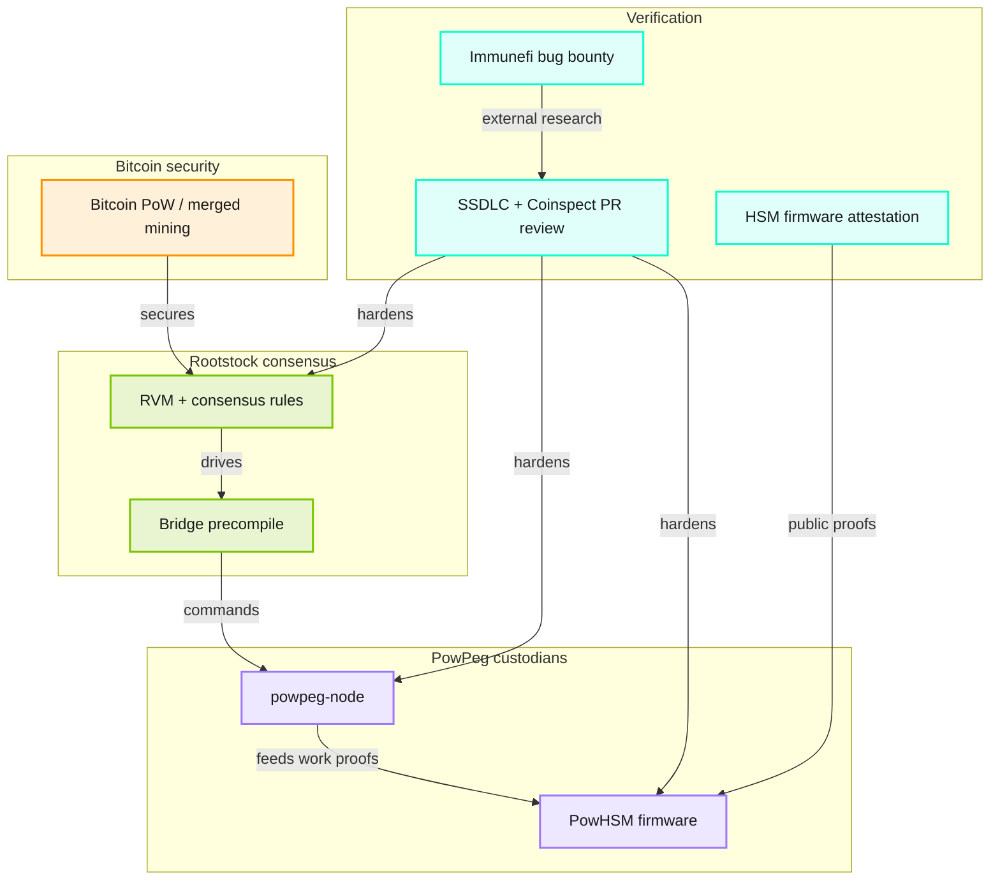

This page provides a comprehensive overview of the Rootstock security model, covering Bitcoin-backed consensus, PowPeg defense in depth, the secure development lifecycle, independent review, and how to verify claims yourself. 

For protocol mechanics of peg-in and peg-out, see [PowPeg](/concepts/powpeg/). For merge-mining difficulty outcomes, see [Merged mining](/concepts/merged-mining/). For the platform layer map, see the [Rootstock Stack](/concepts/foundations/stack/).

## Why is Rootstock secure?

Rootstock's consensus security comes from Bitcoin via merged mining. Rootstock then adds independent controls for Rootstock-specific risks, such as the PowPeg. Those controls do not make Rootstock more secure than Bitcoin. They reduce the chance that a failure in any one Rootstock component becomes a single point of compromise. An attacker targeting the peg or related components would have to defeat several of those controls together, not one at a time.

### Bitcoin-backed security

Through [merged mining](/concepts/merged-mining/), blocks are produced by the same miners that secure Bitcoin, at no extra cost to them. Rootstock is secured by over **85%** of Bitcoin's hash power. This ties Rootstock block production, and bridge enforcement that depends on Rootstock confirmations, to Bitcoin's proof of work.

### Layered PowPeg architecture

The two-way peg between Bitcoin and Rootstock, the [PowPeg](/concepts/powpeg/), is a federated system rather than a single custodian:

- The native **Bridge** precompiled contract controls operations.
- Independent third parties (**pegnatories**) each run a `powpeg-node` and a **PowHSM**.
- The PowHSM is a tamper-resistant hardware device that holds a private key in the bridge multi-signature.
- It signs a peg-out only after the Rootstock chain presents sufficient cumulative proof of work.

BTC releases are authorized by Bitcoin's mining, not by the discretion of any operator. **No single pegnatory can control locked BTC or extract the multi-sig private key from the PowHSM.** Not even a majority of pegnatories can release BTC without a valid Bridge command backed by enough cumulative work.

The federation currently signs as **5-of-9**, with a roadmap to expand toward **20** members after upcoming network upgrades. Composition changes follow an on-chain process described in [PowPeg member updates](/concepts/powpeg/member-updates/).

Peg-out signing requires Bridge commands backed by on the order of **4000** Rootstock confirmation blocks, with cumulative proof of work currently equivalent to approximately **100** Bitcoin blocks. Exact thresholds are enforced by consensus and PowHSM firmware. Confirm current values in the Bridge and PowHSM documentation when you integrate.

### Defense in depth

No single safeguard is load-bearing. Independent layers reinforce one another:

| Layer | Role |
| --- | --- |
| Bitcoin hashpower | Secures Rootstock consensus via merged mining |
| Multi-signature bridge | Distributes key shares across pegnatories |
| PowHSM hardware | Holds keys in a secure element; signs only valid commands |
| Bridge contract logic | Builds peg-out transactions and enforces rules on-chain |
| Monitoring | Detects anomalies such as attempts to revert transactions |

| Orange | Green | Purple | Cyan |
| --- | --- | --- | --- |
| Bitcoin PoW | Rootstock / Bridge | PowPeg node and HSM | Verification controls |

## How does Rootstock stay secure?

Those security properties are the output. What sustains them is the system that produces and maintains the code: security embedded across the development lifecycle, validated by an independent partner, and reinforced continuously after code ships.

### Secure development lifecycle

Rootstock follows a secure software development lifecycle (SSDLC). Security is integrated into every phase of development rather than treated as a checkpoint before release. This maps to frameworks such as NIST SSDF (SP 800-218), OWASP SAMM, and the Microsoft Security Development Lifecycle. Vulnerabilities are surfaced early, when they are cheaper and safer to fix.

#### Security by design

Security involvement begins before production code exists. When the RootstockLabs Research and Incubation team builds a proof of concept or MVP that may land on the Rootstock blockchain, the security team reviews it while the design is still evolving. When that work is handed to development, security reviews the final proposal. Protocol-level changes proposed as RSKIPs are reviewed as part of the proposal process. By the time a change reaches the development pipeline, security has already weighed in on both the concept and the proposal.

#### Code reviews

Every pull request merged into a release-candidate or default branch of the core codebases passes at least three independent reviews:

- at least one developer peer
- the RootstockLabs security team
- Coinspect, an independent external security firm

This applies to `rskj` (the node implementation) and `powpeg-node` (the bridge software run by pegnatories). It applies uniformly to features, bug fixes, minor improvements, and technical-debt paydown. Reviewing every change as it lands is stronger than relying only on periodic point-in-time audits: nothing merges unreviewed, feedback arrives while the author still has full context, and remediation stays at its lowest cost.

#### Supply-chain integrity

Both `rskj` and `powpeg-node` run the [OpenSSF Scorecard](https://securityscorecards.dev/), which grades a repository against security best practices (required code review, branch protections, CI least-privilege, dependency pinning). The check runs on a schedule and when branch-protection rules change. Each repository publishes its current score as a Scorecard badge in its README so a third party can confirm that review controls are enforced.

The repositories also run CodeQL static analysis and automated dependency review on incoming changes. Both repositories produce reproducible builds so a released binary can be checked against its source.

### Independent validation

Independent external review is a permanent part of the model, not an occasional engagement.

#### Coinspect

[Coinspect](https://www.coinspect.com/), an independent blockchain security company, has worked with RootstockLabs since 2017. Early on they helped establish the security function. As the internal team matured, Coinspect became an organizationally independent partner integrated into day-to-day work. Their responsibilities include:

- co-review and approval of every PR merged to release-candidate and default branches of `rskj` and `powpeg-node`
- security design reviews and feature proposal assessment
- collaboration on bug bounty triage
- independent quarterly security reports published in the [security repository](https://github.com/rsksmart/security)

#### PowHSM releases

PowHSM firmware follows a more conservative process. Each release candidate is reviewed by the RootstockLabs security team. Every major release additionally receives a dedicated external audit. Between major releases, changes are typically bug fixes and maintenance that do not touch the critical components that guard bridge funds. Those parts change rarely and deliberately, so external scrutiny concentrates on full audits of major releases.

#### External audits

Independent audits by specialist firms assess Rootstock infrastructure over time. These sit on top of the continuous review gate. Published reports are listed on [Security reports](/concepts/foundations/security/reports/) and in the [security repository](https://github.com/rsksmart/security).

### Continuous security

Shipping code is the start of the security lifecycle, not the end.

#### Bug bounty

RootstockLabs has run a public bug bounty program since 2018, currently on [Immunefi](https://immunefi.com/bug-bounty/rootstocklabs/information/). To date the program has paid out more than US$150,000 in rewards.

| Asset class | Top reward (Critical) |
| --- | --- |
| Blockchain/DLT: PowHSM firmware | up to US$200,000 |
| Blockchain/DLT: `powpeg-node` / `rskj` | up to US$50,000 |
| Smart contracts | up to US$100,000 |
| Websites and applications | up to US$10,000 |

The program is triaged by Immunefi, requires a working proof of concept for every submission, requires KYC for payout, and pays rewards in USDC. The highest tier is reserved for PowHSM firmware. Full scope and rules are on the Immunefi program page.

#### Continuous improvement

Beyond the bounty, the security team hardens the chain, the bridge, and user funds: participating in feature design and integrating security tooling where the return justifies it. Security is an ongoing engineering investment.

## How can I verify that?

| Resource | Link |
| --- | --- |
| View Security reports | [Security reports](/concepts/foundations/security/reports/) |
| Open source repo | [github.com/rsksmart](https://github.com/rsksmart) |
| OpenSSF Scorecard | [rskj](https://github.com/rsksmart/rskj) · [powpeg-node](https://github.com/rsksmart/powpeg-node) |
| Bug bounty | [Immunefi: RootstockLabs](https://immunefi.com/bug-bounty/rootstocklabs/information/) |
| PowHSM attestation | [HSM firmware attestation](/concepts/powpeg/hsm-firmware-attestation/) |
| PowPeg protocol | [PowPeg](/concepts/powpeg/) |
| Merged mining | [Merged mining](/concepts/merged-mining/) |
| Stack | [Rootstock Stack](/concepts/foundations/stack/) |
