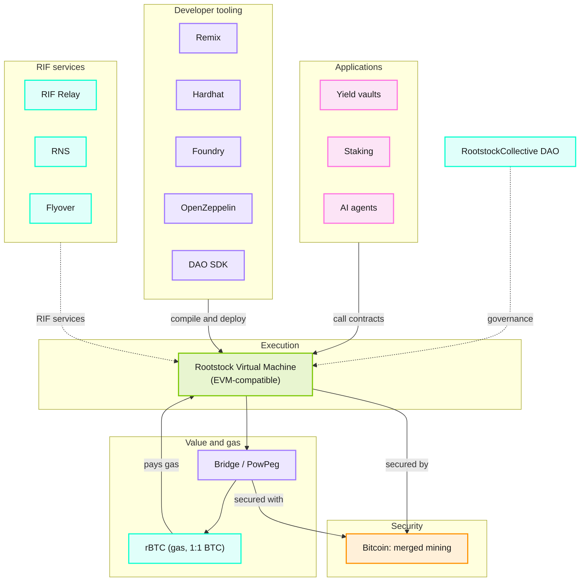

The Rootstock Virtual Machine (RVM) is the core of the smart contract platform. Smart contracts are executed by all network full nodes. Execution can process inter-contract messages, create monetary transactions, and change contract-persistent memory. The RVM is compatible with the EVM at the opcode level, so Ethereum contracts can run on Rootstock.

Currently the VM is executed by interpretation. In a future network upgrade, the Rootstock community aims to improve VM performance substantially. One proposal is to emulate the EVM by dynamically retargeting EVM opcodes to a subset of Java-like bytecode, with a security-hardened and memory-restricted Java-like VM (RVM2). That may bring Rootstock execution performance closer to native code.

## Main features

* Independent virtual machine, highly compatible with EVM at the opcode level
* Run Ethereum dApps with the security of the Bitcoin network
* Performance improvement pipeline documented in RSKIPs from the Rootstock community
  * See the [Rootstock Improvement Proposals](https://github.com/rsksmart/RSKIPs)

<section>

  

  

      <h2 class="zg-text-bg fs-28">Bitcoin</h2><h3 class="fp-title-color fp-title-color-sm">BTC</h3>
  

    
 Is a store and transfer of value.
The blockchain is secure because miners
with high infrastructure and energy costs
create the new blocks to be added to the blockchain every 10 minutes.
The more hashing power they provide, the more secure the network is.

  

    

        
<h2 class="zg-text-bg fs-28">Rootstock</h2><h3 class="fp-title-color fp-title-color-sm">rBTC</h3>

            
 Is the first open source smart contract platform that is
        powered by the bitcoin network.
        Rootstock's goal is to add value and functionality to the
        bitcoin ecosystem by enabling smart-contracts,
        near instant payments, and higher-scalability.

        
rBTC is the native currency in Rootstock and it is used to pay for the gas required for the execution of transactions. It is pegged 1:1 with Bitcoin, which means in Rootstock there are exactly 21M rBTC. A PowPeg allows the transfer of bitcoins from the Bitcoin blockchain to the Rootstock blockchain and vice-versa.

    

</section>

## Architecture overview

Rootstock sits on Bitcoin via merged mining. dApps call the Rootstock Virtual Machine (RVM) directly. Developer tools are used at build time. RIF services and RootstockCollective sit beside the stack. The PowPeg and rBTC connect value and gas to Bitcoin. For how those layers are secured, see [Security at Rootstock](/concepts/foundations/security/).

## The Stack

When you build Bitcoin DeFi on Rootstock, you interact with the **Rootstock Virtual Machine (RVM)**. Because the RVM is fully EVM-compatible, you can use industry-standard tools like **Remix, Hardhat, and Foundry** to manage Bitcoin-native assets.

### Architecture diagram

Applications and developer tools both call the RVM. RIF services and RootstockCollective also connect to the RVM. Below that sit the Bridge/PowPeg and rBTC. Bitcoin merged mining secures the base. Layer items are examples, not a full product list.

