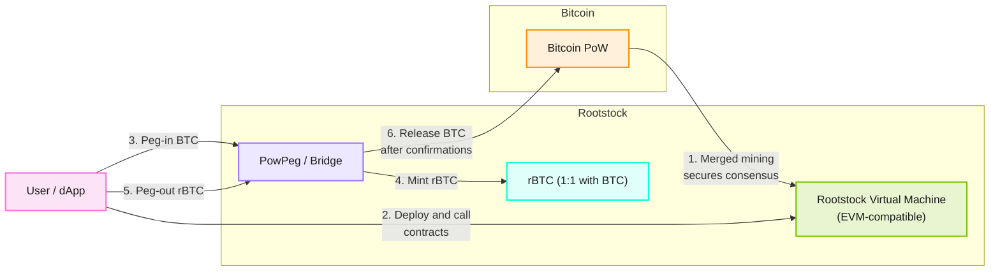

This module explains how Rootstock works under the hood, including the Bitcoin peg, merge-mining, and the Rootstock Virtual Machine (RVM).

:::tip[New to Rootstock?]
Before diving into the architecture, ensure you have read the [Blockchain Overview](/developers/blockchain-essentials/overview/) for a high-level understanding of Rootstock's core features and compatibility.
:::

## Architecture Overview

Rootstock combines the best of both worlds: Bitcoin's industry-leading security and Ethereum's powerful smart contract capabilities. This is achieved through three main architectural pillars:

- **[Merge-Mining](/developers/blockchain-essentials/overview/#merged-mining):** Allows Bitcoin miners to secure the Rootstock network simultaneously.
- **[PowPeg](/developers/blockchain-essentials/overview/#powpeg):** A trust-minimized bridge enabling 2-way transfers between BTC and rBTC.
- **[Rootstock Virtual Machine (RVM)](/developers/blockchain-essentials/overview/#evm-compatible-smart-contracts):** An EVM-compatible execution environment for smart contracts.

This architecture ensures that Rootstock remains the most secure and functional smart contract platform tied to the Bitcoin ecosystem.

## rBTC: Rootstock's Gas Token

rBTC is pegged 1:1 with BTC and is the native token used to pay for transaction fees (gas) and smart contract execution on Rootstock. This allows you to use Bitcoin for decentralized applications without leaving the ecosystem. To understand how gas works on Rootstock, see the [Gas Differences](/developers/blockchain-essentials/overview/#gas-differences) section.

## Architecture Diagram

| Pink | Orange | Green | Purple | Cyan |
| --- | --- | --- | --- | --- |
| User / dApp | Bitcoin | RVM execution | PowPeg bridge | rBTC |

Rootstock is a Bitcoin sidechain. Merged mining provides security. The RVM runs EVM-compatible contracts. The PowPeg moves value between BTC and rBTC.

Merged mining (1) is continuous security, not a user click. Peg-in (3–4) and peg-out (5–6) are separate flows through the same Bridge.

## Summary

Rootstock combines:
- **Bitcoin security** via merged mining
- **EVM programmability** via the Rootstock Virtual Machine
- **BTC ↔ rBTC transfers** via the PowPeg (peg-outs require confirmations and PowHSM signatures)

:::note[Before You Continue]
Make sure you've completed the [Development Prerequisites](/developers/requirements/) to set up your environment with Node.js, Hardhat, and wallet configuration.
:::

**Next:** [Smart Contract Fundamentals](/developers/blockchain-essentials/rootstock-essentials/smart-contract-fundamentals/)
