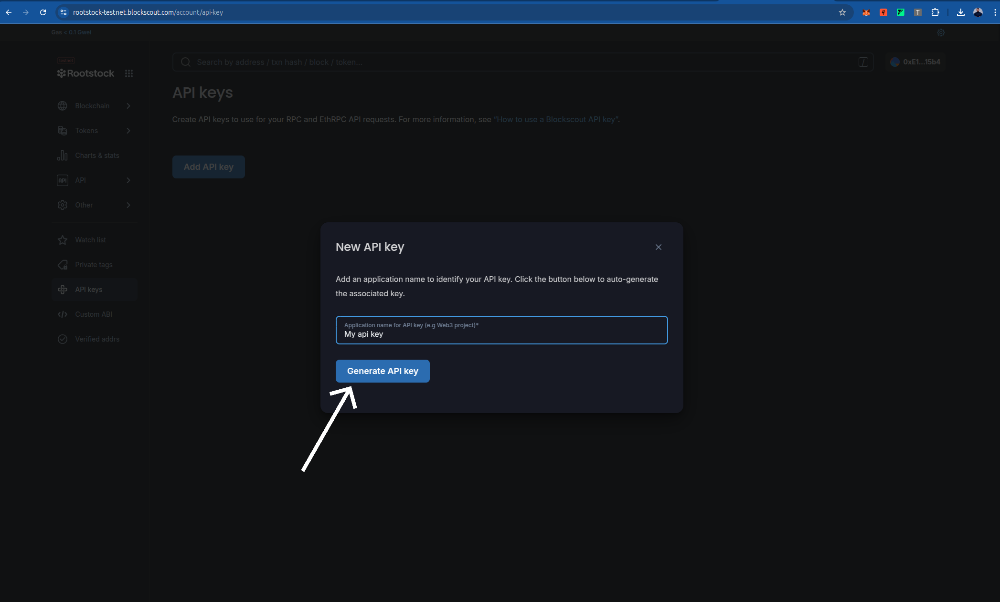

Smart contracts are the backbone of decentralized applications (dApps). They automate agreements and processes, but their code can be complex and prone to errors. Verifying your smart contracts is crucial to ensure they function as intended.

This tutorial will guide you through verifying your contracts using Foundry on the Rootstock Blockscout Explorer. Foundry is a powerful toolkit spektrum for Ethereum development, and its `forge` tool simplifies the verification of Solidity smart contracts deployed on the Rootstock network. By verifying the contracts, you allow Blockscout, an open-source block explorer, to link your contract's source code with its deployed bytecode on the blockchain, enabling trustless interaction with the code.

In this tutorial, we'll do the following steps:

- Set up your Foundry configuration environment in your project
- Use Foundry's `forge verify-contract` to verify a contract address

## Prerequisites

To follow this tutorial, you should have knowledge of the following:

- Foundry
- Basic knowledge of smart contracts

:::note[Foundry Starter Project]
A Foundry starter project can be set up with preset configurations for the Rootstock network. Initialize a new Foundry project using `forge init` and configure it as shown below. Ensure you set up the `.env` variables to match the `foundry.toml` configuration.
:::

To add a step-by-step guide for obtaining a Rootstock API key from Blockscout, you can insert the following section into the tutorial, ideally after the **Prerequisites** section and before the **Configuration** section, as it logically fits where users need to prepare their API key for the `foundry.toml` configuration. Below is the proposed addition, formatted to match the tutorial's style and tone:

---

## Obtaining a Rootstock API Key from Blockscout

To verify smart contracts on the Rootstock Blockscout Explorer, you need an API key. Follow these steps to obtain one:

1. **Visit the Blockscout Explorer**:
   - For Rootstock Mainnet, go to [https://rootstock.blockscout.com/](https://rootstock.blockscout.com/).
   - For Rootstock Testnet, go to [https://rootstock-testnet.blockscout.com/](https://rootstock-testnet.blockscout.com/).


2. **Sign In or Register**:

   - Click on the "Sign In" or "Register" button, usually located in the top-right corner of the Blockscout website.

   
   - If you don’t have an account, create one by providing an email address or choose web3 wallet. Verify your email if prompted.

4. **Access Your Account Settings**:
   - Once logged in, click on your profile (often represented by your wallet address or a user icon) and select "Account" or "API Keys" from the dropdown menu.

5. **Generate an API Key**:

   - In the API Keys section, click "Create New API Key" or a similar button.

   
   - Provide a name for the API key (e.g., "Foundry Verification") to help you identify its purpose.
   - Copy the generated API key and store it securely. You will not be able to view it again after leaving the page.

6. **Use the API Key in Foundry**:
   - Add the API key to your `foundry.toml` configuration file under the `[etherscan]` section, as shown in the **Configuration** section below. Replace `"your api key"` with the key you obtained.

:::tip[Tip]
Keep your API key confidential and avoid sharing it publicly. If you suspect it has been compromised, regenerate a new key from your Blockscout account.
:::

---

### Integration into the Tutorial

To integrate this section, place it after the **Prerequisites** section and update the **Configuration** section to reference it. For example, modify the **Configuration** section to start with:

---

## Configuration

Before proceeding, ensure you have obtained a Rootstock API key from Blockscout as described in the **Obtaining a Rootstock API Key from Blockscout** section. Create or update the `foundry.toml` file in your project root to include Rootstock network configurations. Add the following:

```toml
[profile.default]
src = "src"
out = "out"
libs = ["lib"]
solc_version = "0.8.24"
optimizer = true
optimizer_runs = 200
evm_version = "london"

[rpc_endpoints]
rskTestnet = "${RSK_TESTNET_RPC_URL}"
rskMainnet = "${RSK_MAINNET_RPC_URL}"
anvil = "http://127.0.0.1:8545"

[etherscan]
rskTestnet = { key = "your api key", url = "https://rootstock-testnet.blockscout.com/api" }
rskMainnet = { key = "your api key", url = "https://rootstock-blockscout.com/api" }
```

---

### Notes
- The steps assume Blockscout’s user interface remains consistent. If the interface changes, users may need to adapt to the new layout, but the general process (sign in, access account, generate API key) should remain similar.
- The tutorial avoids hardcoding specific URLs or button names that might change, using generic terms like "API section" or "Account Settings" to ensure longevity.
- The added section maintains the tutorial’s Markdown formatting and includes a tip box for best practices, aligning with the existing style.

## Usage

To verify a deployed contract, use the `forge verify-contract` command. You need the contract address and the contract name (as defined in your Solidity file). Run the following command:

For Rootstock Testnet:

```bash
forge verify-contract --chain-id 31 --verifier blockscout --verifier-url https://rootstock-testnet.blockscout.com/api DEPLOYED_CONTRACT_ADDRESS src/YourContract.sol:YourContract
```

For Rootstock Mainnet:

```bash
forge verify-contract --chain-id 30 --verifier blockscout --verifier-url https://rootstock.blockscout.com/api DEPLOYED_CONTRACT_ADDRESS src/YourContract.sol:YourContract
```
To deploy and verify with your script, use the `forge script` command. Run the following command:

For Rootstock Testnet:

```bash
forge script script/deploy.s.sol --rpc-url RSK_TESTNET_RPC_URL --broadcast --verify --legacy --evm-version london --verifier-url https://rootstock-testnet.blockscout.com/api --verifier blockscout
```
The response should look like this:

```
Submitting verification for [src/veriChainDao.sol:VeriChainDAO] 0xB390a97B95E4878626a6DBe5Ef836CA1d1A0463A.
Submitted contract for verification:
        Response: `OK`
        GUID: `b390a97b95e4878626a6dbe5ef836ca1d1a0463a6806239d`
        URL: https://rootstock-testnet.blockscout.com/address/0xb390a97b95e4878626a6dbe5ef836ca1d1a0463a
Contract verification status:
Response: `OK`
Details: `Pending in queue`
Contract verification status:
Response: `OK`
Details: `Pass - Verified`
Contract successfully verified
All (6) contracts were verified!
For Rootstock Mainnet:
```

```bash
forge script script/deploy.s.sol --rpc-url RSK_MAINNET_RPC_URL --broadcast --verify --legacy --evm-version london --verifier-url https://rootstock.blockscout.com/api --verifier blockscout
```

:::tip[Tip]
Replace `DEPLOYED_CONTRACT_ADDRESS` with the actual contract address and `YourContract` with the name of your contract. The contract address can be found in the deployment artifacts or logs after running `forge script`.
:::

### Example

Assuming you deployed a contract named `MockERC721` at address `0x33aC0cc41B11282085ff6db7E1F3C3c757143722` on the Rootstock Testnet, run:

```bash
forge verify-contract --chain-id 31 --verifier blockscout --verifier-url https://rootstock-testnet.blockscout.com/api 0x33aC0cc41B11282085ff6db7E1F3C3c757143722 src/ERC721.sol:MockERC721
```

The response should look like this:

```
Submitting verification for MockERC721...
Successfully submitted source code for contract src/ERC721.sol:MockERC721 at 0x33aC0cc41B11282085ff6db7E1F3C3c757143722
Waiting for verification result...
Successfully verified contract MockERC721 on the block explorer.
https://rootstock-testnet.blockscout.com/address/0x33aC0cc41B11282085ff6db7E1F3C3c757143722#code
```

## Resources
- [Deploy, Interact and Verify Smart Contracts using Remix and Rootstock Explorer](/developers/quickstart/remix/)
- Visit [hardhat-verify](https://hardhat.org/hardhat-runner/plugins/nomicfoundation-hardhat-verify#hardhat-verify)
- Visit [blockscout](https://docs.blockscout.com/for-users/verifying-a-smart-contract/hardhat-verification-plugin)
- [Hardhat Starter Kit for Rootstock](https://github.com/rsksmart/rootstock-hardhat-starterkit)
---