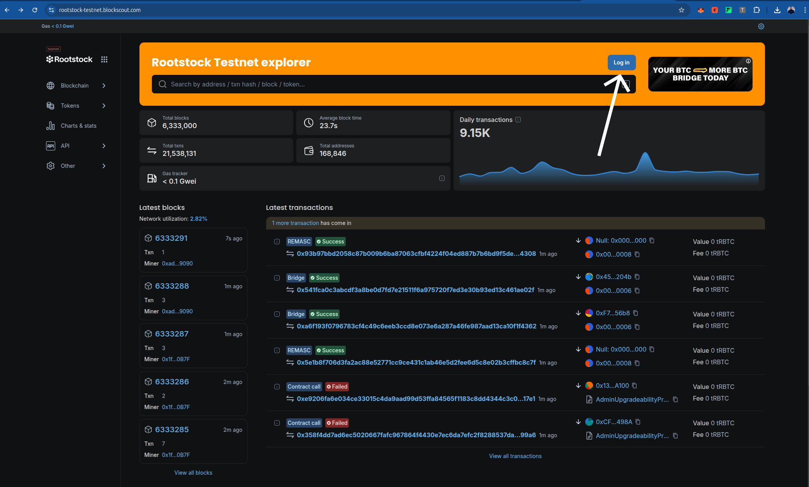
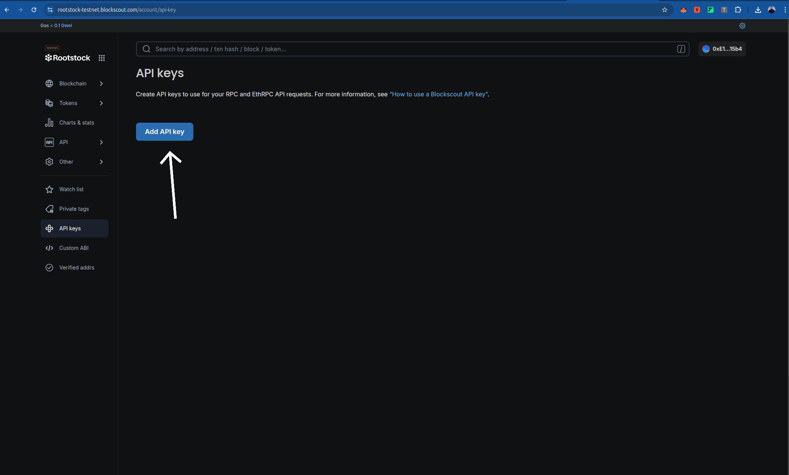

---

sidebar_label: Verify a Smart Contract using Foundry and Blockscout Explorer
sidebar_position: 400
title: Verify a Smart Contract using Foundry and Blockscout Explorer
description: "Configuring Foundry for smart contract verification on Rootstock"
tags: [guides, developers, smart contracts, rsk, rootstock, foundry, dApps, ethers]
---


Smart contracts are the backbone of decentralized applications (dApps). They automate agreements and processes, but their code can be complex and prone to errors. Verifying your smart contracts is crucial to ensure they function as intended.

This tutorial will guide you through verifying your contracts using Foundry on the Rootstock Blockscout Explorer. Foundry is a powerful toolkit spektrum for Ethereum development, and its `forge` tool simplifies the verification of Solidity smart contracts deployed on the Rootstock network. By verifying the contracts, you allow Blockscout, an open-source block explorer, to link your contract's source code with its deployed bytecode on the blockchain, enabling trustless interaction with the code.

In this tutorial, we'll do the following steps:

- Set up your Foundry configuration environment in your project
- Use Foundry's `forge verify-contract` to verify a contract address

## Prerequisites

   To follow this tutorial, you should have knowledge of the following:

   - Foundry
   - Basic knowledge of smart contracts

   :::note [Foundry Starter Project](https://github.com/rsksmart/rootstock-foundry-starterkit)
   A Foundry starter project can be set up with preset configurations for the Rootstock network. Initialize a new Foundry project using `forge init` and configure it as shown below. Ensure you set up the `.env` variables to match the `foundry.toml` configuration.
   :::
---

## Obtaining a Rootstock API Key from Blockscout

   To verify smart contracts on the Rootstock Blockscout Explorer, you need an API key. Follow these steps to obtain one:

1. **Visit the Blockscout Explorer**:
   - For Rootstock Mainnet, go to [https://rootstock.blockscout.com/](https://rootstock.blockscout.com/).
   - For Rootstock Testnet, go to [https://rootstock-testnet.blockscout.com/](https://rootstock-testnet.blockscout.com/).


2. **Sign In or Register**:
   
   - Click on the "Sign In" or "Register" button, usually located in the top-right corner of the Blockscout website.

   
   - If you don’t have an account, create one by providing an email address or choose web3 wallet. Verify your email if prompted.

4. **Access Your Account Settings**:
   - Once logged in, click on your profile (often represented by your wallet address or a user icon) and select "Account" or "API Keys" from the dropdown menu.

5. **Generate an API Key**:
   
   - In the API Keys section, click "Create New API Key" or a similar button.

   
   - Provide a name for the API key (e.g., "Foundry Verification") to help you identify its purpose.
   - Copy the generated API key and store it securely. You will not be able to view it again after leaving the page.

6. **Use the API Key in Foundry**:
   - Add the API key to your `foundry.toml` configuration file under the `[etherscan]` section, as shown in the **Configuration** section below. Replace `"your api key"` with the key you obtained.

:::tip[Tip]
   Keep your API key confidential and avoid sharing it publicly. If you suspect it has been compromised, regenerate a new key from your Blockscout account.
:::

---

### Integration into the Tutorial

   To integrate this section, place it after the **Prerequisites** section and update the **Configuration** section to reference it. For example, modify the **Configuration** section to start with:

---

## Configure Foundry

   Before proceeding, ensure you have obtained a Rootstock API key from Blockscout as described in the [Obtaining a Rootstock API Key from Blockscout](#obtaining-a-rootstock-api-key-from-blockscout) section. Create or update the `foundry.toml` file in your project root to include Rootstock network configurations. Add the following:

   ```toml
   [profile.default]
   src = "src"
   out = "out"
   libs = ["lib"]
   solc_version = "0.8.24"
   optimizer = true
   optimizer_runs = 200
   evm_version = "london"

   [rpc_endpoints]
   rskTestnet = "${RSK_TESTNET_RPC_URL}"
   rskMainnet = "${RSK_MAINNET_RPC_URL}"
   anvil = "http://127.0.0.1:8545"

   [etherscan]
   rskTestnet = { key = "your api key", url = "https://rootstock-testnet.blockscout.com/api" }
   rskMainnet = { key = "your api key", url = "https://rootstock-blockscout.com/api" }
   ```

---
## Deploy the Contract

   After configuring Foundry, you can deploy a smart contract to the Rootstock network using the Foundry Starter Kit or your own project. Follow these steps:

1. **Clone the Foundry Starter Kit**:
   ```bash
   git clone https://github.com/rsksmart/rootstock-foundry-starterkit
   cd rootstock-foundry-starterkit
   #do well to edit with your smartcontract.
   ```
   **you should see something like this**:
   ```bash
   cyberhackb@cyberhackb-ThinkPad-X1-Nano-Gen-1:~/Downloads$ git clone https://github.com/rsksmart/rootstock-foundry-starterkit
   cd rootstock-foundry-starterkit
   Cloning into 'rootstock-foundry-starterkit'...
   remote: Enumerating objects: 374, done.
   remote: Counting objects: 100% (53/53), done.
   remote: Compressing objects: 100% (21/21), done.
   remote: Total 374 (delta 41), reused 32 (delta 32), pack-reused 321 (from 1)
   Receiving objects: 100% (374/374), 259.07 KiB | 154.00 KiB/s, done.
   Resolving deltas: 100% (129/129), done.
   ```
   ```bash
   forge install
   ```
   ```bash
   cyberhackb@cyberhackb-ThinkPad-X1-Nano-Gen-1:~/Downloads/rootstock-foundry-starterkit$ forge install
   Updating dependencies in /home/cyberhackb/Downloads/rootstock-foundry-starterkit/lib
   Submodule 'lib/openzeppelin-contracts' (https://github.com/OpenZeppelin/openzeppelin-contracts) registered for path 'lib/openzeppelin-contracts'
   Cloning into '/home/cyberhackb/Downloads/rootstock-foundry-starterkit/lib/openzeppelin-contracts'...
   remote: Enumerating objects: 50354, done.        
   remote: Counting objects: 100% (100/100), done.        
   remote: Compressing objects: 100% (74/74), done.        
   remote: Total 50354 (delta 54), reused 26 (delta 26), pack-reused 50254 (from 3) ....       
   ........................................................................................
   ......remote: Compressing objects: 100% (79/79), done.        
   remote: Total 313 (delta 91), reused 132 (delta 83), pack-reused 142 (from 1)        
   Receiving objects: 100% (313/313), 71.35 KiB | 312.00 KiB/s, done.

2. **Compile your smart contract to ensure there are no errors**:
   ```bash
   forge build

   ```
   ```bash
   cyberhackb@cyberhackb-ThinkPad-X1-Nano-Gen-1:~/Downloads/rootstock-foundry-starterkit$ forge build
   [⠊] Compiling...
   [⠊] Compiling 38 files with Solc 0.8.17
   [⠒] Solc 0.8.17 finished in 1.90s
   Compiler run successful!
   ```
3. **Set Up Environment Variables**:
   Create a .env file in the project root and add your private
   ```bash
   echo "PRIVATE_KEY=your_private_key" >> .env
   echo "RSK_TESTNET_RPC_URL=https://public-node.testnet.rsk.co" >> .env
   echo "RSK_MAINNET_RPC_URL=https://public-node.rsk.co" >> .env
   ```

4. **Load the environment variables:**

   ```bash
   source .env
   ```
5. **Deploy the Contract: Use a Foundry script to deploy the contract.**:
   ```bash
   forge script script/deploy.s.sol --rpc-url $RSK_TESTNET_RPC_URL --broadcast --legacy --evm-version london
   ```
  

   ```bash
   cyberhackb@cyberhackb-ThinkPad-X1-Nano-Gen-1:~/Downloads/rootstock-foundry-starterkit$ forge script script/deploy.s.sol --rpc-url $RSK_TESTNET_RPC_URL --broadcast --legacy --evm-version london
   #The response should look like this:
   [⠊] Compiling...
   [⠘] Compiling 2 files with Solc 0.8.17
   [⠊] Solc 0.8.17 finished in 1.72s
   Compiler run successful!
   Script ran successfully.

   == Logs ==
   Deploying with account: 0xE122199bB9617d8B0e814aC903042990155015b4
   Deployer balance: 0 RBTC/ETH
   MockV3Aggregator deployed at: 0xD48bB9503C5Caba9D0Cbbac8B6Ea4F0613C37Bd1
   
   Deployment Summary:
   MockV3Aggregator: 0xD48bB9503C5Caba9D0Cbbac8B6Ea4F0613C37Bd1
   

   ## Setting up 1 EVM.

   ==========================

   Chain 31

   Estimated gas price: 0.004724958 gwei

   Estimated total gas used for script: 11072149

   Estimated amount required: 0.000052315438994742 ETH

   ==========================

   ##### 31
   ✅  [Success]Hash: 0x0b1f512835a75b63a6be18f82cf0b631563d6c76b944c3f33bc22f0d2ed239a5
   Contract Address: 0xD48bB9503C5Caba9D0Cbbac8B6Ea4F0613C37Bd1
   Block: 6416881
   Paid: 0.000000648103589028 ETH (137166 gas * 0.004724958 gwei)

   ✅ Sequence #1 on 31 | Total Paid: 0.00003991405908021 ETH (8447495 gas * avg 0.004724958 gwei)
                                                                                                                                                                                                         
   ==========================

   ONCHAIN EXECUTION COMPLETE & SUCCESSFUL.

   Transactions saved to: /home/cyberhackb/Downloads/rootstock-foundry-starterkit$/broadcast/deploy.s.sol/31/run-latest.json

   Sensitive values saved to: /home/cyberhackb/Downloads/rootstock-foundry-starterkit$/cache/deploy.s.sol/31/run-latest.json
   ```
## Usage

   To verify a deployed contract, use the `forge verify-contract` command. You need the contract address and the contract name (as defined in your Solidity file). Run the following command:

   For Rootstock Testnet:

   ```bash
   forge verify-contract --chain-id 31 --verifier blockscout --verifier-url https://rootstock-testnet.blockscout.com/api "0xD48bB9503C5Caba9D0Cbbac8B6Ea4F0613C37Bd1" src/mockAggregator.sol:MockAggregator
   #remeber to edit to your contract address and contract name
   ```

The response should look like this:

   ```bash
   Submitting verification for [src/mockAggregator.sol:MockAggregator] 0xD48bB9503C5Caba9D0Cbbac8B6Ea4F0613C37Bd1.
   Submitted contract for verification:
         Response: `OK`
         GUID: `b390a97b95e4878626a6dbe5ef836ca1d1a0463a6806239d`
         URL: https://rootstock-testnet.blockscout.com/address/0xD48bB9503C5Caba9D0Cbbac8B6Ea4F0613C37Bd1
   Contract verification status:
   Response: `OK`
   Details: `Pending in queue`
   Contract verification status:
   Response: `OK`
   Details: `Pass - Verified`
   Contract successfully verified
   All (6) contracts were verified!
   For Rootstock Mainnet:
   ```
## Resources
- [Deploy, Interact and Verify Smart Contracts using Remix and Rootstock Explorer](/developers/quickstart/remix/)
- Visit [hardhat-verify](https://hardhat.org/hardhat-runner/plugins/nomicfoundation-hardhat-verify#hardhat-verify)
- Visit [blockscout](https://docs.blockscout.com/for-users/verifying-a-smart-contract/hardhat-verification-plugin)
- [Hardhat Starter Kit for Rootstock](https://github.com/rsksmart/rootstock-hardhat-starterkit)
---