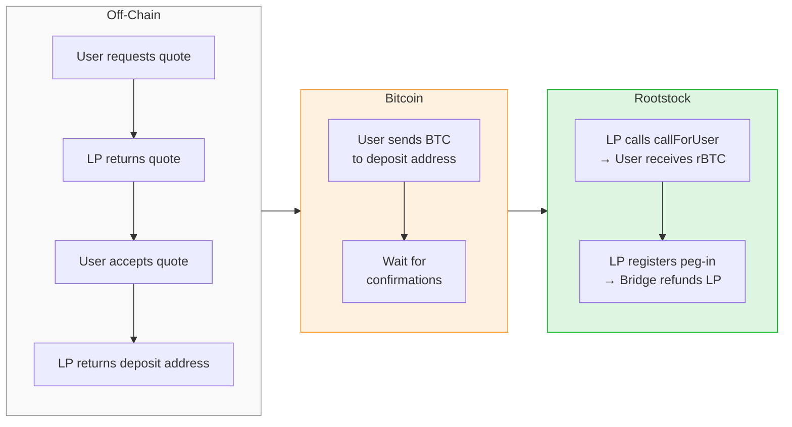
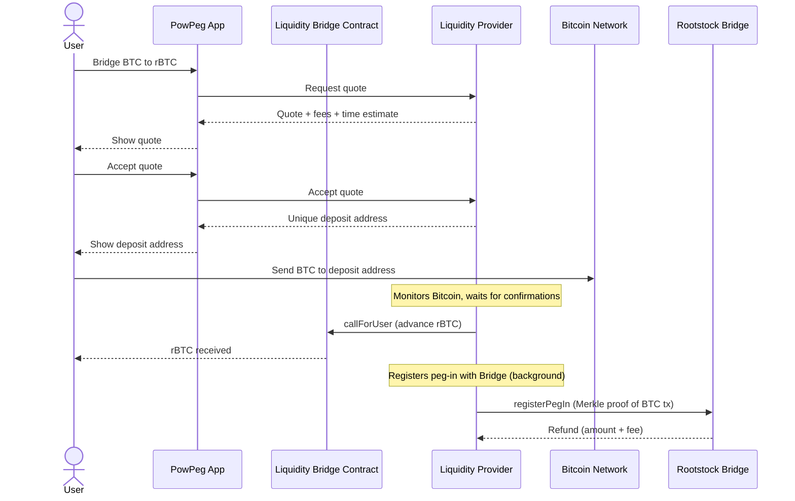
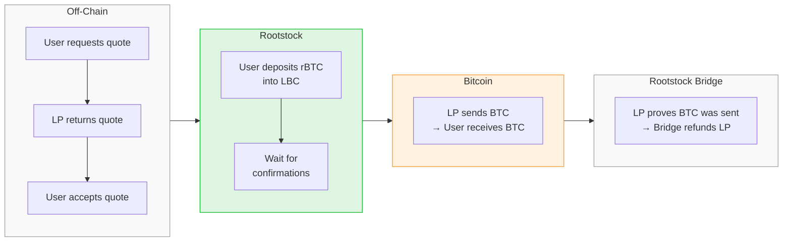
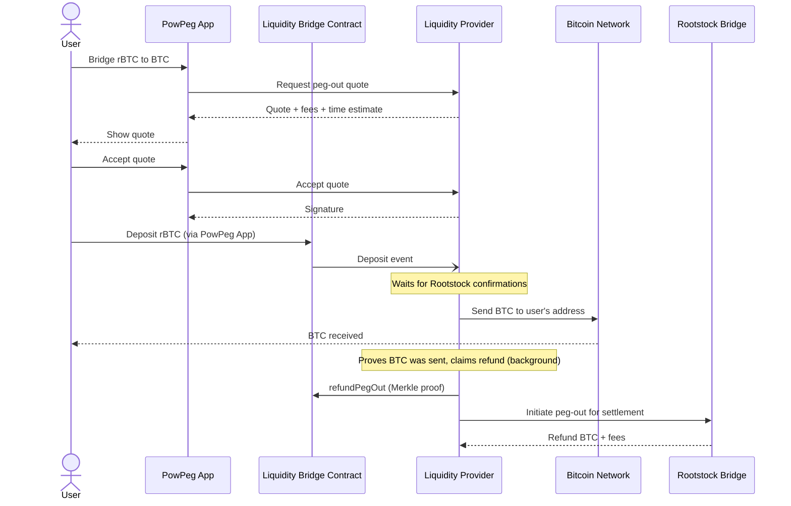

Flyover is Rootstock's fast bridge for BTC ↔ rBTC. Instead of waiting ~17 hours for PowPeg, a Liquidity Provider (LP) advances funds after a few confirmations. The user gets their rBTC or BTC in 20–60 minutes, depending on the amount.

```
PowPeg:
  User sends BTC → waits ~17 hours → receives rBTC

Flyover:
  User sends BTC → LP advances rBTC in 20–60 min → LP gets refunded later via PowPeg
```

---

## PowPeg vs Flyover

|  | PowPeg | Flyover |
| --- | --- | --- |
| **Core mechanism** | Federated 2-Way Peg (HSMs + PoW) | LP advances funds, settles via PowPeg |
| **Peg-in speed** | ~17 hours (100 Bitcoin confirmations) | 20–60 min |
| **Peg-out speed** | ~34 hours (4,000 Rootstock confirmations) | 20–60 min |
| **Fees** | Network fees only | 0.15% LP fee + network fees * |
| **Minimum peg-in** | 0.005 BTC | 0.00500001 BTC |
| **Minimum peg-out** | 0.004 rBTC | 0.004 rBTC |
| **Maximum** | None | 15 BTC / 15 rBTC * |
| **Trust model** | PowPeg federation | LP intermediation, settles through PowPeg |

Flyover's speed depends on the amount: smaller amounts need fewer Bitcoin confirmations and settle faster; larger amounts need more.

* The LP fee is set by each LP. 0.15% is the current default but may vary.
* Maximum transfer limits are set by the LP and will increase over time.

---

## How Flyover Works

### Peg-In: BTC to rBTC



**1. Get a quote**
The user requests a quote through the PowPeg App. The quote shows the amount of rBTC the user will receive, fees, required Bitcoin confirmations, and a time estimate.

**2. Accept the quote**
The user must carefully review the quote details — including the amount, fees, confirmations required, and time estimate — and explicitly accept it before proceeding. Once the user accepts, the LP generates a unique Bitcoin deposit address tied to this specific quote. The address is derived from the quote hash — every transaction gets its own address.

**3. Deposit BTC**
The user sends BTC to the deposit address. The LP monitors Bitcoin and waits for the required number of confirmations.

**4. LP delivers rBTC**
Once confirmed, the LP calls the Liquidity Bridge Contract (LBC) on Rootstock to send rBTC to the user's address.

**5. LP claims refund (background)**
The LP registers the peg-in with the Rootstock Bridge, providing a Merkle proof of the Bitcoin transaction. The Bridge verifies the proof and refunds the LP the original amount plus the fee. This is invisible to the user.

#### Sequence Diagram



### Peg-Out: rBTC to BTC



**1. Get a quote**
The user requests a quote showing the BTC they'll receive, fees, and time estimate.

**2. Accept the quote**
The LP reserves BTC liquidity and returns a signature.

**3. Deposit rBTC**
The user deposits rBTC into the Liquidity Bridge Contract on Rootstock. The contract locks the funds and emits an event that the LP monitors.

**4. LP sends BTC**
Once the rBTC deposit has enough Rootstock confirmations, the LP sends BTC to the user's Bitcoin address.

**5. LP claims refund (background)**
The LP submits a Merkle proof of the BTC payment to the Liquidity Bridge Contract and settles through the Rootstock Bridge. This happens in the background.

#### Sequence Diagram



---

## Security

Flyover builds on PowPeg — live since 2018 with 100% uptime and operational excellence — and inherits its security guarantees.

### Non-Custodial

The LP never has access to user funds. In a peg-in, user BTC goes directly to a PowPeg federation-controlled address. In a peg-out, user rBTC is locked in the Liquidity Bridge Contract (LBC), which acts as the trusted third party instead of the federation. In both cases, the LP advances funds from its own separate balance and cannot access, redirect, or withhold user funds at any point in the process.

### Trust Model

|  | What happens | Enforced by |
| --- | --- | --- |
| **Quote negotiation** | User and LP agree on terms off-chain | LP signs quote cryptographically |
| **Fund movement** | BTC deposited to federation address (peg-in) or rBTC locked in LBC (peg-out) | On-chain — Bitcoin network / Rootstock smart contract |
| **LP delivery** | LP advances funds to user | On-chain — LBC verifies and records |
| **Settlement** | LP claims refund via Merkle proof | On-chain — Rootstock Bridge verifies proof |
| **Deadlines** | Every quote has time limits for deposit and delivery | On-chain — LBC enforces deadlines |

**What the user does not need to trust:**
- The LP with their BTC — it goes directly to the PowPeg federation, not the LP
- The LP to be honest — delivery and settlement are verified on-chain

**What the LP commits to:**
- Advancing funds within the quoted deadline
- Locking collateral in the LBC as a guarantee

### On-Chain Guarantees

The Liquidity Bridge Contract (LBC) enforces:

- **Quote terms** — the LP's signed quote is verified on-chain during settlement
- **Collateral** — LPs must lock collateral before participating. Slashed if the LP fails to deliver.
- **Deadlines** — if the LP misses the delivery deadline, collateral is slashed and the user receives a refund in rBTC
- **Merkle proofs** — LP settlement requires cryptographic proof that funds were sent

Quote negotiation happens off-chain. Everything else — fund custody, delivery, deadlines, settlement — is enforced on-chain.

### Failure Scenarios

| Scenario | Outcome |
| --- | --- |
| **LP doesn't deliver within deadline** | LP's collateral is slashed. User receives a refund in rBTC. |
| **LP goes offline before accepting a quote** | No transaction starts. User can choose another LP, PowPeg, or aggregated routes. |
| **User doesn't deposit in time** | Quote expires. No funds are moved. |

### Audited

The Liquidity Bridge Contract is audited. The PowPeg Bridge is a core Rootstock protocol component, live since 2018 with 100% uptime and operational excellence.

---

## Key Concepts

### Liquidity Bridge Contract (LBC)

The smart contract on Rootstock that coordinates Flyover transactions. It holds quotes, verifies proofs, manages LP collateral, and handles refunds.

**Contract addresses:**
- Mainnet: `0xaa9caf1e3967600578727f975f283446a3da6612`
- Testnet: `0xc2a630c053d12d63d32b025082f6ba268db18300`

### Fees

| Fee | Description |
| --- | --- |
| **LP fee** | Set by each LP. Currently 0.15% of the transaction value |
| **Network fees** | Bitcoin transaction fees + Rootstock gas |

All fees are shown in the quote before you confirm.

### Limits

|  | Minimum | Maximum |
| --- | --- | --- |
| Peg-in | 0.00500001 BTC | 15 BTC * |
| Peg-out | 0.004 rBTC | 15 rBTC * |

* Maximum transfer limits are set by the LP and will increase over time.

---

## Who Is Flyover For?

### Institutional Users

Flyover supports institutional custody through MPC wallet integration. Fordefi is supported today (using a segwit vault) for both peg-in and peg-out operations.

- Predictable timing (20–60 min) with clear deadlines in every quote
- Transparent fees — 0.15% + network fees, shown upfront
- Non-custodial — the LP never has access to your funds
- Transaction limits at 15 BTC / 15 rBTC, increasing over time
- Programmatic access via the Flyover SDK

### Liquidity Providers

LPs provide liquidity in rBTC and BTC, earning fees on every transaction. An LP can be an exchange, a wallet provider, an institution, or an individual with sufficient capital.

**Requirements:**
- Rootstock node and Bitcoin node (private, dedicated — not public nodes)
- MongoDB instance
- Minimum collateral: 0.06 rBTC
- Wallet setup (local keystore or custodial integration)

See [LP Onboarding](/developers/integrate/flyover/LP/) for setup instructions and [LP Management](/developers/integrate/flyover/LP/management/) for the management API.

### Developers and Integrators

The Flyover SDK provides JavaScript/TypeScript tools for integrating Flyover into wallets, dApps, exchanges, and other applications.

```
npm install @rsksmart/flyover-sdk
```

See [Flyover SDK Integration](/developers/integrate/flyover/sdk/) for the full guide.

---

## Resources

- [Flyover Protocol Paper](https://eprint.iacr.org/2023/086.pdf) — formal protocol design and security analysis
- [Flyover SDK on GitHub](https://github.com/rsksmart/flyover-sdk)
- [LP Onboarding](/developers/integrate/flyover/LP/)
- [LP Management API](/developers/integrate/flyover/LP/management/)
- [PowPeg App](https://powpeg.rootstock.io)
