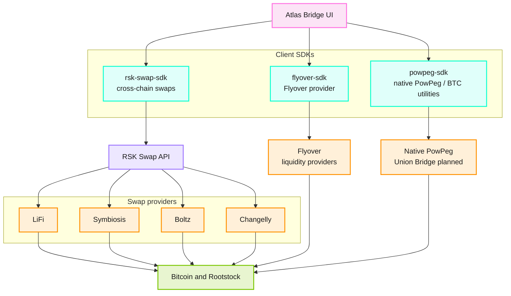

Atlas Bridge is a cross-chain bridge for the Rootstock ecosystem. You can use it to move assets between Rootstock and other supported networks.

- Peg-in means you move assets into Rootstock.
- Peg-out means you move assets out of Rootstock.

## How Atlas fits the stack

Atlas uses three client libraries. Each one opens a different bridge or swap path. Funds end on Bitcoin or Rootstock.

### Architecture diagram

Atlas talks to three libraries: PowPeg, Flyover, and RSK Swap. Cross-chain swaps go through the RSK Swap API to LiFi, Symbiosis, Boltz, and Changelly. Flyover and native PowPeg use their own libraries. Every route ends on Bitcoin or Rootstock.



`rsk-swap-sdk` quotes and runs swaps through the RSK Swap API (LiFi, Symbiosis, Boltz, Changelly). `flyover-sdk` handles Flyover. `powpeg-sdk` handles native PowPeg and Bitcoin utilities. Union Bridge work is planned for `powpeg-sdk`.

Atlas lets you compare routes before you connect a wallet. To quote and swap from your own app, start with the RSK Swap SDK.

## Prerequisites
You need a wallet for the source network and a wallet address for the destination network. You also need enough balance to cover both transfer amount and fees.

Do not send funds from exchange deposit addresses. Use wallets you control.

## Getting Started
To get started, read [How to use Atlas Bridge](/resources/guides/atlas/getting-started-atlas/). Find and resolve common errors in the [FAQ](/resources/guides/atlas/faq/).

## Integrate with the RSK Swap SDK

[Atlas Bridge](https://atlas.rootstock.io) is the web interface for comparing provider routes before you connect a wallet. To quote and execute swaps from your own wallet, exchange, or dApp, use the [RSK Swap SDK](https://github.com/rsksmart/rsk-swap-sdk). The SDK calls the RSK Swap API. That API returns routes from LiFi, Symbiosis, Boltz, and Changelly. Supported pairs and providers come from the API at request time. They can differ from the routes Atlas shows in the UI.

Install the package:

```bash
npm install @rsksmart/rsk-swap-sdk
```

The SDK estimates routes, reads swap limits, broadcasts EVM transactions through your connected wallet, and returns BIP21 or BOLT11 strings for Bitcoin and Lightning steps. Chain IDs identify EVM networks. Pass `BTC` for Bitcoin and `LN` for Lightning. Use `BTC` or `tBTC` to select mainnet or testnet on those networks. See the [RSK Swap SDK repository](https://github.com/rsksmart/rsk-swap-sdk) for setup, examples, and API reference.

### Related SDKs

Atlas also uses these client SDKs for other routes:

- [Flyover SDK](https://github.com/rsksmart/flyover-sdk) for the Flyover liquidity-provider path
- [PowPeg SDK](https://github.com/rsksmart/powpeg-sdk) for native PowPeg and Bitcoin utilities. Union Bridge work is planned to land here.

### Store swap context securely

When you create a swap, the SDK returns a result object with a `context` field. That field holds provider-specific data for claiming or refunding the swap. Some providers include sensitive client-side material in `context`, such as keys for atomic swaps. The SDK generates this data in the browser or your app. It does not send `context` to the RSK Swap API.

Persist the full swap result in storage you control. Treat `context` as secret. Do not log it, cache it in plain text, or send it to analytics or support channels unless your runbook requires it.

## Before you bridge
Atlas lets you compare provider routes, amounts, and estimated completion times before you connect a wallet. This helps you choose a route that matches your amount, speed target, and fee tolerance.

### Minimum Transaction Amounts
If Atlas shows no provider for your amount, your amount is often below a provider minimum.

| Provider | Minimum Peg-In | Minimum Peg-Out |
| :--- | :---: | ---: |
| Flyover - Teks | 0.00500001 BTC | 0.004 rBTC |
| Changelly | Equivalent of 30 USD | Equivalent of 30 USD |
| Boltz | 0.00001 BTC | 0.00001 rBTC |
| Native | 0.005 BTC | 0.004 rBTC |

:::tip[Tip]

For some providers, minimums do not include fees. Keep extra balance in the source wallet.
:::

### Mainnet
Available swaps on [Mainnet](https://atlas.rootstock.io/):

- rBTC → BTC (L1)
- BTC (L1) → rBTC
- rBTC → BTC (Lightning)
- BTC (Lightning) → rBTC
- ETH → rBTC
- USDT → rBTC
- USDC → rBTC
- WBTC → rBTC
- BNB → rBTC
- rBTC → ETH
- rBTC → USDT
- rBTC → USDC
- rBTC → BNB
- rBTC → WBTC

### Testnet
Available swaps on [Testnet](https://atlas.testnet.rootstock.io/):

- trBTC → BTC (L1)
- BTC (L1) → trBTC

## Expected Time & Confirmations
Bridging depends on source-chain confirmations and provider processing. Times below are estimates. Actual times vary with network conditions.

| Provider | Peg-In | Peg-Out |
| :--- | :---: | :---: |
| Flyover - Teks | 20m | 20m |
| Flyover - Rootstock | 20m | 20m |
| Changelly | 15m | 15m |
| Boltz | 1m | 5m |
| Native | 17h | 34h |

## Safety checks before confirmation
Use this checklist before you submit:
- Confirm source and destination networks.
- Confirm destination address on the correct chain.
- Confirm amount after fees.
- Keep the transaction hash for support and tracking.

## Where to Get Help
If you run into issues:
- Check the [FAQ](/resources/guides/atlas/faq/) first.
- Use [Rootstock Discord](https://rootstock.io/discord) for community help.
- Contact the team via [Rootstock Contact Us](https://rootstock.io/contact/).

## Resources

- [Get rBTC: Comprehensive Guide to Bridging to Rootstock](https://rootstock.io/blog/get-rbtc-comprehensive-guide-to-bridging-to-rootstock/)
- [Rootstock: the most secure and advanced Bitcoin layer](https://rootstock.io/technology/)
- [rBTC overview](https://rootstock.io/rbtc/)
- [Release Notes](https://github.com/rsksmart/bridge/releases)